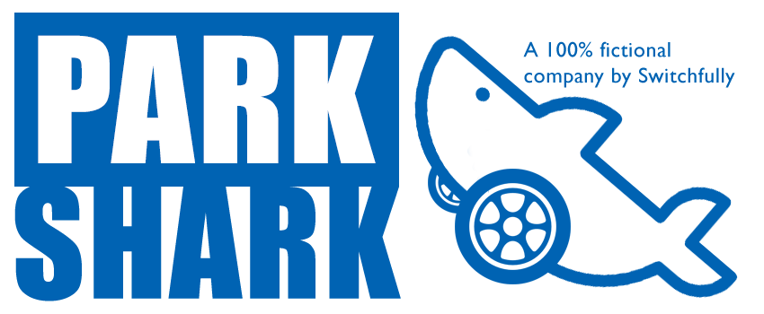

# ParkShark

ParkShark is a totally legit pay-to-use parking lot company.
Their goal is to take over the (underground) world of parking lots. They first tried to accomplish this by using violence.
However, they figured a mobile app that automates their processes might also get the job done.
As a bonus, that solution will involve less killing. This mobile-app will be used by both ParkShark customers
and ParkShark managers.

The front-end of ParkShark will be created by a freelancer who they'll never pay (that's what the *free* in freelancer stands for after all).

The front-end (mobile app) of ParkShark will communicate with the back-end of ParkShark using an HTTP(S) implementation of REST
using JSON as its message format. This back-end wi